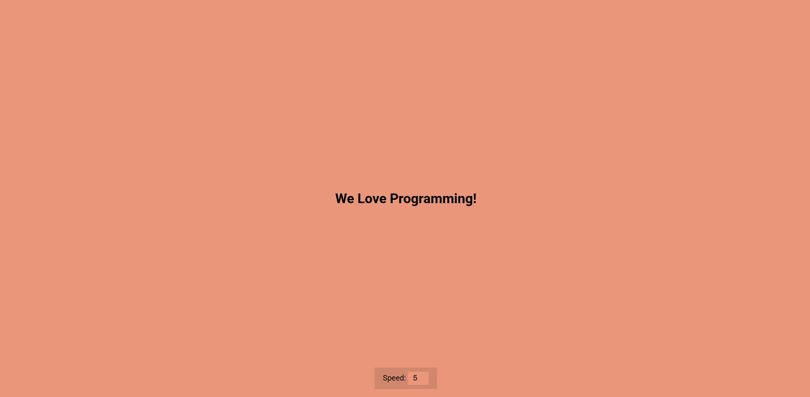

# Auto Text Effect

A dynamic text animation that displays "We Love Programming!" with a typewriter effect. Users can control the animation speed in real-time.

## Features

- **Typewriter Animation**: Text appears character by character, creating a realistic typing effect
- **Speed Control**: Adjustable speed slider (1-10) to control animation timing
- **Responsive Design**: Works on all screen sizes
- **Real-time Updates**: Speed changes take effect immediately

## How It Works

The project uses JavaScript to:

1. Display text character by character using `slice()`
2. Loop the animation when it reaches the end
3. Allow users to control speed via an input slider
4. Update animation timing in real-time

## Usage

1. Open `index.html` in your web browser
2. Watch the text "We Love Programming!" appear with a typewriter effect
3. Use the speed slider to adjust animation speed (1 = slowest, 10 = fastest)
4. The animation will continuously loop

## Files

- `index.html` - Main HTML structure
- `style.css` - Styling and layout
- `script.js` - JavaScript functionality for the text animation
- `images/text.jpg` - Demo screenshot

## Technologies Used

- HTML5
- CSS3
- Vanilla JavaScript

## Preview

The application shows a heading that displays "We Love Programming!" with a typewriter effect, along with a speed control slider below it.
